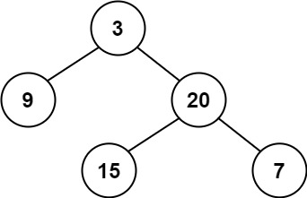

110. Balanced Binary Tree

Given a binary tree, determine if it is height-balanced.

Example 1:

Input: root = [3,9,20,null,null,15,7]
Output: true

Example 2:

Input: root = [1,2,2,3,3,null,null,4,4]
Output: false
Example 3:

Input: root = []
Output: true