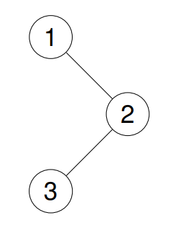
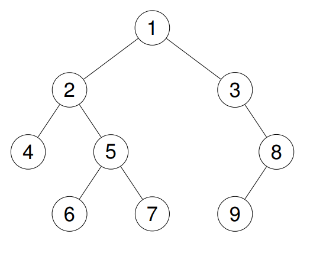

94. Binary Tree Inorder Traversal

Given the root of a binary tree, return the inorder traversal of its nodes' values.

 
Example 1:

Input: root = [1,null,2,3]

Output: [1,3,2]

Explanation:

Example 2:

Input: root = [1,2,3,4,5,null,8,null,null,6,7,9]

Output: [4,2,6,5,7,1,3,9,8]

Explanation:

Example 3:

Input: root = []

Output: []

Example 4:

Input: root = [1]

Output: [1]