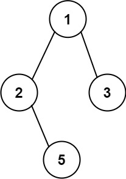

257. Binary Tree Paths

You are given the root of a binary tree.

Return all root-to-leaf paths in any order.

A leaf is a node with no children.

 

Example 1:

Input: root = [1,2,3,null,5]
Output: ["1->2->5","1->3"]
Example 2:

Input: root = [1]
Output: ["1"]