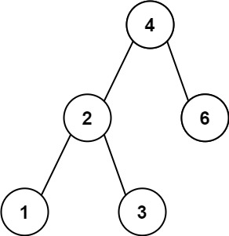
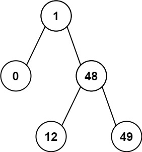

530. Minimum Absolute Difference in BST

Given the root of a Binary Search Tree (BST), return the minimum absolute difference between the values of any two different nodes in the tree.

 
Example 1:

Input: root = [4,2,6,1,3]
Output: 1

Example 2:

Input: root = [1,0,48,null,null,12,49]
Output: 1