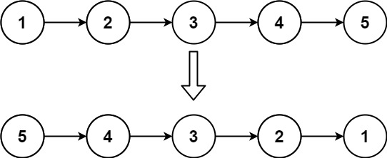
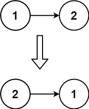

206. Reverse Linked List

Given the head of a singly linked list, reverse the list, and return the reversed list.

Example 1:

Input: head = [1,2,3,4,5]
Output: [5,4,3,2,1]

Example 2:

Input: head = [1,2]
Output: [2,1]

Example 3:

Input: head = []
Output: []