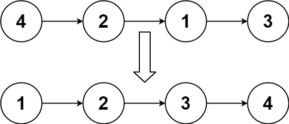
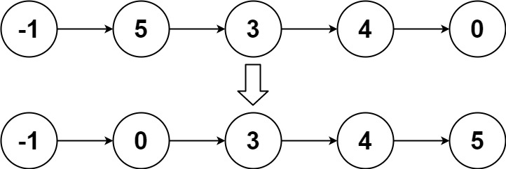

148. Sort List

Given the head of a linked list, return the list after sorting it in ascending order.

Example 1:

Input: head = [4,2,1,3]
Output: [1,2,3,4]

Example 2:

Input: head = [-1,5,3,4,0]
Output: [-1,0,3,4,5]

Example 3:

Input: head = []
Output: []